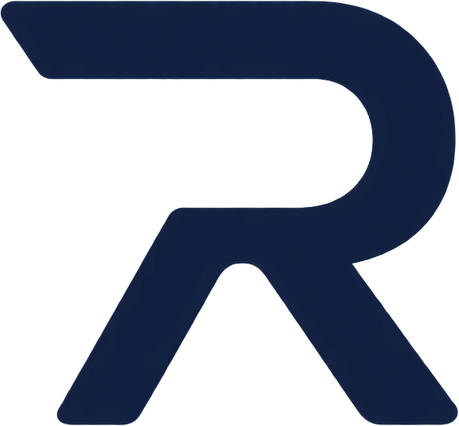

# Rundle

**_(n.)_ a rung of a ladder.**

Tiered fallback for inference workloads.

> [!WARNING]
> Under active development. APIs may change without notice.

## Overview

Rundle routes inference requests through an ordered chain of providers,
falling through to the next rung when one fails, times out, or rate-limits.

## Installation

```bash
# TODO
```

## Usage

```python
# TODO
```

## License

TODO
